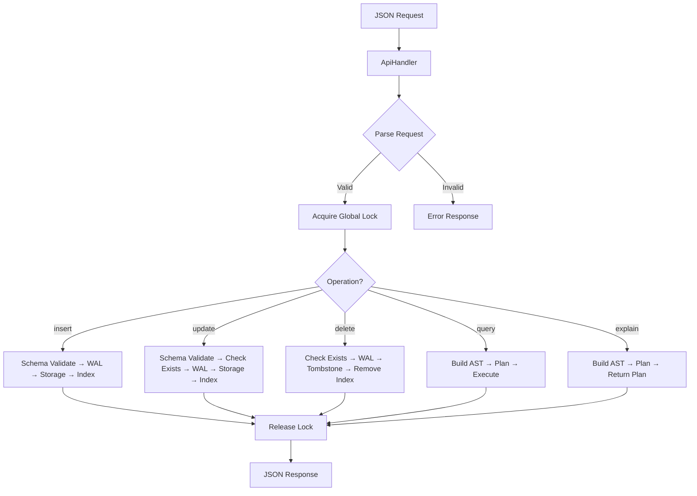

# API Layer Implementation Walkthrough

## Overview

The API layer serves as the orchestration layer for all aerodb operations, enforcing a global execution lock and implementing the strict request handling flow.

## Architecture



## Module Structure

| File | Purpose |
|------|---------|
| [mod.rs](file:///home/snigdha/aerodb/src/api/mod.rs) | Public interface, re-exports |
| [errors.rs](file:///home/snigdha/aerodb/src/api/errors.rs) | API-specific errors with pass-through |
| [request.rs](file:///home/snigdha/aerodb/src/api/request.rs) | Request parsing (insert, update, delete, query, explain) |
| [response.rs](file:///home/snigdha/aerodb/src/api/response.rs) | Success/Error response formatting |
| [handler.rs](file:///home/snigdha/aerodb/src/api/handler.rs) | Core orchestration with global mutex |

## Key Design Decisions

### Global Mutex Serialization
All requests are serialized through a single `Mutex<()>`:
```rust
pub fn handle(&self, json_request: &str, subsystems: &mut Subsystems<'_>) -> Response {
    let _guard = self.lock.lock().expect("Lock poisoned");
    // ... handle request ...
    // Lock released when _guard drops
}
```

### Subsystems Pattern
Subsystem references are passed explicitly to avoid borrow conflicts:
```rust
pub struct Subsystems<'a> {
    pub schema_loader: &'a SchemaLoader,
    pub wal_writer: &'a mut WalWriter,
    pub storage_writer: &'a mut StorageWriter,
    pub storage_reader: &'a mut StorageReader,
    pub index_manager: &'a mut IndexManager,
}
```

### Request Handling Flow

**Writes (insert/update/delete):**
1. Schema validation (insert/update only)
2. Check document exists (update/delete only)
3. WAL append (durability first)
4. Storage write
5. Index update

**Queries:**
1. Build Query AST from request
2. Call Planner (produces bounded plan)
3. Execute via Index lookups + Storage reads
4. Return results

### Error Propagation
Errors from subsystems pass through unchanged:
```rust
.map_err(ApiError::from_schema_error)?
.map_err(ApiError::from_wal_error)?
.map_err(ApiError::from_storage_error)?
.map_err(ApiError::from_planner_error)?
```

## Tests Implemented (6 tests)

| Test | Purpose |
|------|---------|
| `test_insert_and_query_roundtrip` | Verifies basic data flow |
| `test_invalid_schema_rejected` | Schema validation errors surfaced |
| `test_unbounded_query_rejected` | Queries without indexed filters rejected |
| `test_explain_returns_deterministic_plan` | Same input → same plan |
| `test_serialization_enforced` | Sequential operations work correctly |
| `test_corruption_surfaced` | Error propagation works |

## Test Results

```
test result: ok. 194 passed; 0 failed; 0 ignored
```
