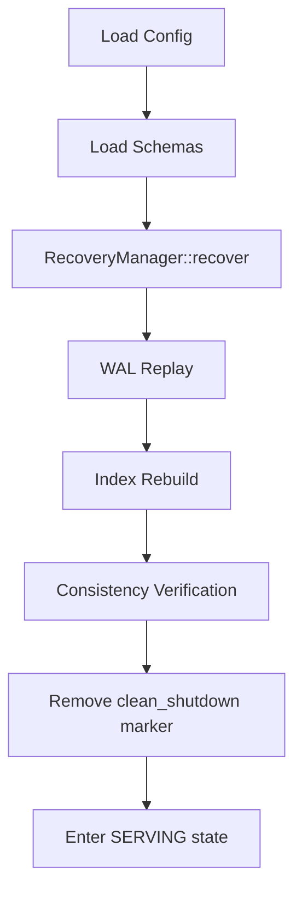

# CLI Module Implementation Walkthrough

## Overview

Implemented the AeroDB Phase-0 CLI per BOOT.md, CONFIG.md, LIFECYCLE.md, and API_SPEC.md.

## Module Structure

| File | Purpose |
|------|---------|
| [mod.rs](file:///home/snigdha/aerodb/src/cli/mod.rs) | Module exports |
| [args.rs](file:///home/snigdha/aerodb/src/cli/args.rs) | Clap command definitions |
| [commands.rs](file:///home/snigdha/aerodb/src/cli/commands.rs) | Command implementations |
| [io.rs](file:///home/snigdha/aerodb/src/cli/io.rs) | JSON stdin/stdout handling |
| [errors.rs](file:///home/snigdha/aerodb/src/cli/errors.rs) | CLI-specific error types |

## Commands

| Command | Behavior |
|---------|----------|
| `aerodb init --config <path>` | Creates directory structure |
| `aerodb start --config <path>` | Boots system with full recovery, enters SERVING loop |
| `aerodb query --config <path>` | One-shot query execution (requires full recovery) |
| `aerodb explain --config <path>` | One-shot explain execution (requires full recovery) |

### `aerodb start` Details

- Performs full recovery and verification before accepting requests
- No serving occurs until recovery completes successfully
- Any recovery failure halts startup immediately (FATAL)

## Boot Sequence (per BOOT.md)



## Recovery Integration

The CLI explicitly invokes `RecoveryManager::recover()` before serving any requests. This is **mandatory** and cannot be skipped.

### Recovery Sequence

1. **Schema Load**: All schemas are loaded from `metadata/schemas/` before recovery begins. This is required for schema validation during consistency verification.

2. **WAL Replay**: The WAL is replayed from byte 0 sequentially. Every record is checksummed and applied to storage. This **always** runs, even after a clean shutdown.

3. **Index Rebuild**: After WAL replay completes, all indexes are rebuilt from storage. Indexes are derived state and are never persisted.

4. **Consistency Verification**: Storage is scanned to verify:
   - All checksums are valid
   - All schema references exist
   - No corruption is present

5. **API Activation**: Only after successful verification does the system:
   - Remove the `clean_shutdown` marker
   - Initialize the API handler
   - Enter the SERVING state

### Failure Handling

- **Any corruption halts startup**: WAL corruption, storage corruption, or checksum failures result in immediate FATAL error
- **Missing schemas halt startup**: Documents referencing unknown schemas cause FATAL error
- **No partial startup**: Either full recovery succeeds or the system does not serve
- **No error catching**: Recovery errors propagate immediately to exit
- **No background threads**: Recovery is synchronous and blocking

### Code Path

```
boot_system()
├── SchemaLoader::load_all()           # Step 1: Load schemas
├── WalReader::open()                  # Step 2: Open WAL for replay
├── RecoveryStorage::open()            # Step 3: Open combined storage adapter
├── RecoveryManager::recover()         # Step 4: Execute recovery
│   ├── WalReplayer::replay()          #   - Replay all WAL records
│   ├── IndexManager::rebuild()        #   - Rebuild indexes
│   └── ConsistencyVerifier::verify()  #   - Verify integrity
├── WalWriter::open()                  # Step 5: Open WAL for new writes
└── Return subsystems                  # Recovery complete
```

## Config Validation (per CONFIG.md)

- `data_dir` (required)
- `max_wal_size_bytes` (default 1GB)
- `max_memory_bytes` (default 512MB)  
- `wal_sync_mode` (must be "fsync")

## Tests (5 tests)

| Test | Purpose |
|------|---------|
| `test_init_creates_directories` | Verifies directory structure |
| `test_init_refuses_reinit` | Already initialized error |
| `test_start_requires_init` | Not initialized error |
| `test_config_validates_sync_mode` | Rejects invalid sync mode |
| `test_config_defaults` | Default values applied |

## Test Results

```
test result: ok. 199 passed; 0 failed; 0 ignored
```
