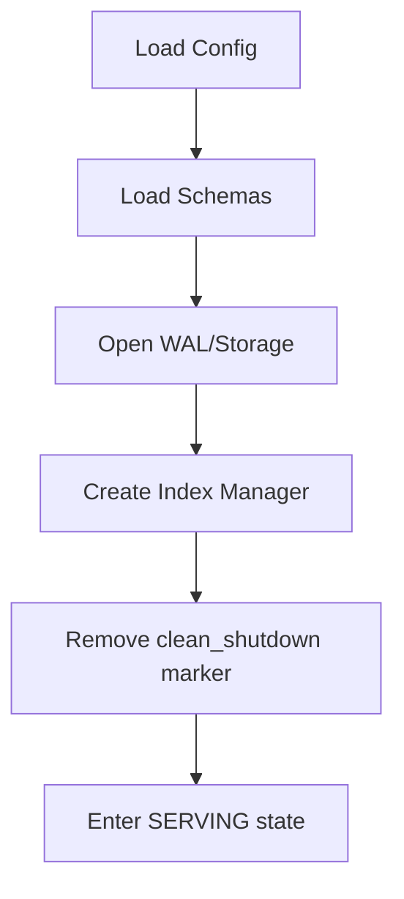

# CLI Module Implementation Walkthrough

## Overview

Implemented the AeroDB Phase-0 CLI per BOOT.md, CONFIG.md, LIFECYCLE.md, and API_SPEC.md.

## Module Structure

| File | Purpose |
|------|---------|
| [mod.rs](file:///home/snigdha/aerodb/src/cli/mod.rs) | Module exports |
| [args.rs](file:///home/snigdha/aerodb/src/cli/args.rs) | Clap command definitions |
| [commands.rs](file:///home/snigdha/aerodb/src/cli/commands.rs) | Command implementations |
| [io.rs](file:///home/snigdha/aerodb/src/cli/io.rs) | JSON stdin/stdout handling |
| [errors.rs](file:///home/snigdha/aerodb/src/cli/errors.rs) | CLI-specific error types |

## Commands

| Command | Behavior |
|---------|----------|
| `aerodb init --config <path>` | Creates directory structure |
| `aerodb start --config <path>` | Boots system, enters SERVING loop |
| `aerodb query --config <path>` | One-shot query execution |
| `aerodb explain --config <path>` | One-shot explain execution |

## Boot Sequence (per BOOT.md)



## Config Validation (per CONFIG.md)

- `data_dir` (required)
- `max_wal_size_bytes` (default 1GB)
- `max_memory_bytes` (default 512MB)  
- `wal_sync_mode` (must be "fsync")

## Tests (5 tests)

| Test | Purpose |
|------|---------|
| `test_init_creates_directories` | Verifies directory structure |
| `test_init_refuses_reinit` | Already initialized error |
| `test_start_requires_init` | Not initialized error |
| `test_config_validates_sync_mode` | Rejects invalid sync mode |
| `test_config_defaults` | Default values applied |

## Test Results

```
test result: ok. 199 passed; 0 failed; 0 ignored
```
