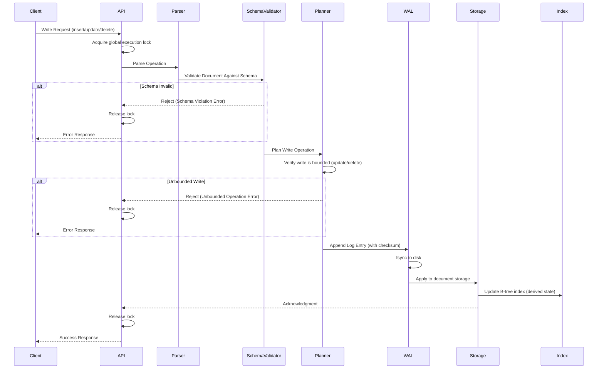
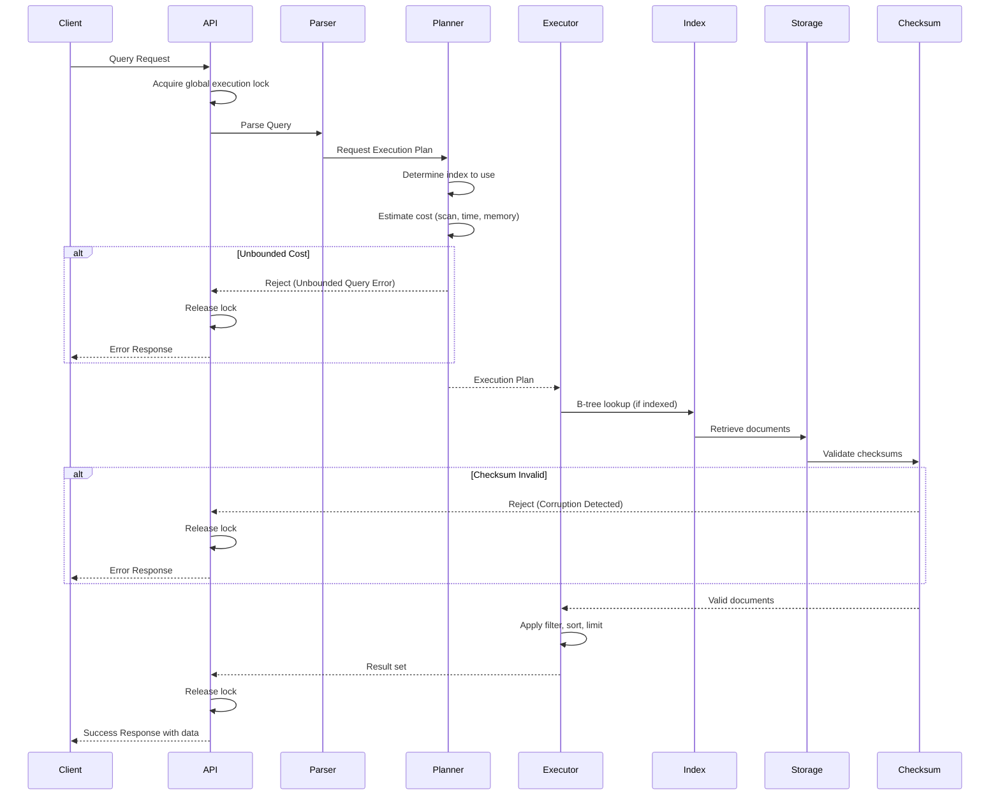
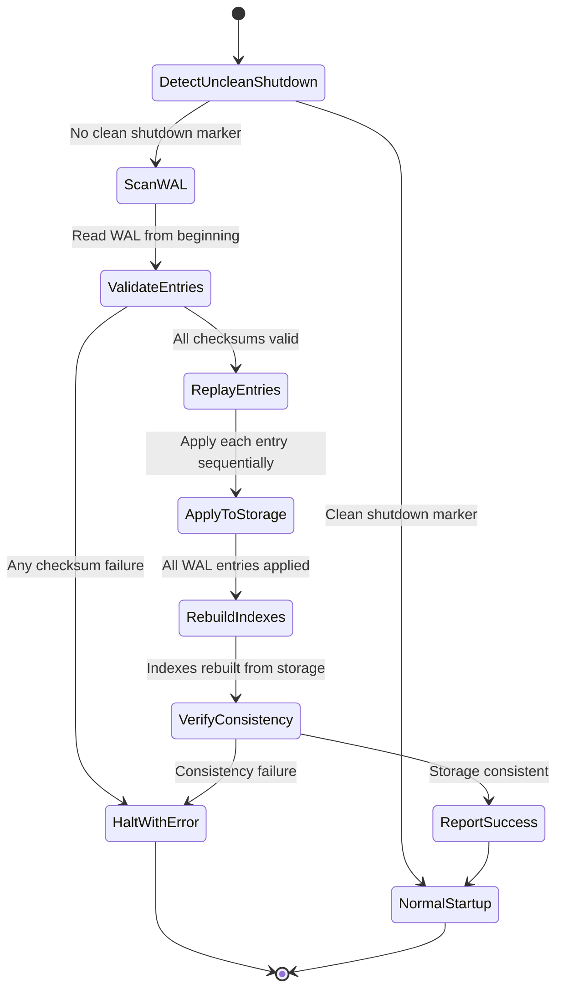

# AeroDB High-Level Architecture Design

> **Design document for Phase 0 — Minimum Viable Infrastructure**
> 
> Single-node, schema-mandatory, WAL-backed, deterministic database engine.

---

## 1. System Overview

aerodb is a single-node document database engine with mandatory schemas, deterministic behavior, and WAL-backed durability. It prioritizes correctness, predictability, and operational clarity over performance, flexibility, or feature breadth.

```mermaid
graph TB
    subgraph "Client Interface"
        API[API Layer]
    end
    
    subgraph "Query Processing"
        Parser[Query Parser]
        Validator[Schema Validator]
        Planner[Deterministic Query Planner]
        Executor[Query Executor]
    end
    
    subgraph "Storage Engine"
        WAL[Write-Ahead Log]
        Index[B-Tree Index Manager]
        Storage[Document Storage]
        Checksum[Checksum Validator]
    end
    
    subgraph "Recovery"
        Recovery[Recovery Manager]
    end
    
    API --> Parser
    Parser --> Validator
    Validator --> Planner
    Planner --> Executor
    Executor --> WAL
    Executor --> Index
    WAL --> Storage
    Index --> Storage
    Storage --> Checksum
    Recovery --> WAL
    Recovery --> Storage
```

---

## 2. Major Components and Responsibilities

### 2.1 API Layer

**Responsibility**: Accept client requests, route to query processing, return results or explicit errors.

| Function | Behavior |
|----------|----------|
| Accept requests | Parse wire protocol, extract operation |
| Return results | Success with data, or explicit error code |
| Reject malformed requests | Fail loudly with structured error |
| Serialize execution | Enforce single-threaded execution (see §2.11) |

**Invariants Upheld**:
- **F1** (Fail Loudly): All errors are explicit and returned to client
- **F2** (No Partial Success): Request either fully succeeds or fully fails
- **O3** (Observable System State): All operations are logged

---

### 2.2 Query Parser

**Responsibility**: Parse query syntax into an internal representation. No interpretation, no guessing.

| Function | Behavior |
|----------|----------|
| Parse query | Convert wire format to AST |
| Reject malformed queries | Explicit syntax error with location |
| No implicit defaults | Missing fields cause rejection, not default values |

**Invariants Upheld**:
- **Q3** (Execution Never Guesses): Ambiguous queries are rejected
- **F3** (Errors Are Deterministic): Same malformed query → same error

---

### 2.3 Schema Validator

**Responsibility**: Enforce that all documents conform to their declared schema before any write.

| Function | Behavior |
|----------|----------|
| Validate documents | Check all fields against schema definition |
| Reject invalid documents | Fail write, no partial persistence |
| Validate schema references | Ensure document references valid schema version |

**Invariants Upheld**:
- **S1** (Schema Presence Is Mandatory): No schemaless writes
- **S2** (Schema Validity Is Enforced on Write): Invalid data never enters storage
- **S3** (Schema Versions Are Explicit): Documents reference explicit schema version
- **S4** (Schema Violations Are Fatal): Validation failure = write rejection

---

### 2.4 Deterministic Query Planner

**Responsibility**: Generate a query execution plan that is deterministic, bounded, and explainable.

| Function | Behavior |
|----------|----------|
| Select index | Choose based on query predicates and available indexes (deterministic rules, no heuristics) |
| Estimate cost | Compute upper bound on data scanned, time, memory |
| Reject unbounded queries | Queries without provable bounds are rejected before execution |
| Produce explain plan | Human-readable plan for any query |

**Determinism Mechanism**:
1. Index selection is rule-based (not statistics-driven heuristics)
2. Rules are versioned and explicit
3. Same (query, schema, indexes) → same plan

**Invariants Upheld**:
- **T1** (Deterministic Planning): Same inputs → same plan
- **T3** (Planner Changes Are Explicit): Any rule change is versioned/opt-in
- **Q1** (Queries Must Be Bounded): Unbounded queries rejected
- **Q2** (No Implicit Full Scans): Scans require explicit declaration

---

### 2.5 Query Executor

**Responsibility**: Execute the plan produced by the planner. No rewriting, no optimization.

| Function | Behavior |
|----------|----------|
| Execute plan steps | Follow plan exactly as specified |
| Enforce limits | Stop at declared limits (time, rows, memory) |
| Return deterministic results | Stable ordering via indexed fields or primary key |

**Invariants Upheld**:
- **T2** (Deterministic Execution): No timing/thread-dependent behavior
- **Q3** (Execution Never Guesses): Execute plan as specified

---

### 2.6 Write-Ahead Log (WAL)

**Responsibility**: Ensure all acknowledged writes are durable before acknowledgment.

| Function | Behavior |
|----------|----------|
| Append log entry | Write operation to WAL with checksum |
| Sync to disk | Explicit `fsync` before acknowledgment |
| Provide recovery source | WAL is the source of truth for crash recovery |

**Invariants Upheld**:
- **D1** (No Acknowledged Write Is Ever Lost): WAL sync before ack
- **R1** (WAL Precedes Acknowledgement): Mandatory
- **R2** (Recovery Is Deterministic): WAL enables deterministic replay

---

### 2.7 Document Storage

**Responsibility**: Store documents on disk in a structured format with integrity validation.

| Function | Behavior |
|----------|----------|
| Persist documents | Write to disk with schema version reference |
| Include checksums | Every record has integrity checksum |
| Support reads | Retrieve documents by primary key or index lookup |

**Invariants Upheld**:
- **D2** (Data Corruption Is Never Ignored): Checksums enable detection
- **D3** (Reads Never Observe Invalid State): Only schema-valid data stored

---

### 2.8 B-Tree Index Manager

**Responsibility**: Maintain B-tree indexes for efficient, bounded lookups.

| Function | Behavior |
|----------|----------|
| Create/drop indexes | Explicit index management only |
| Update indexes | Indexes updated as part of write operation (see §3.1) |
| Support lookups | Equality and bounded range queries |

**Invariants Upheld**:
- **Q1** (Queries Must Be Bounded): Indexes enable bounded execution
- **T1** (Deterministic Planning): Index availability is explicit

---

### 2.9 Checksum Validator

**Responsibility**: Validate integrity of all data read from storage.

| Function | Behavior |
|----------|----------|
| Compute checksums on write | Attach checksum to each record |
| Validate checksums on read | Reject corrupted data |
| Halt on corruption | Fail operation, log explicitly |

**Invariants Upheld**:
- **D2** (Data Corruption Is Never Ignored): Detection is mandatory
- **K1** (Corruption Detection Is Mandatory): Checksums on all records
- **K2** (Corruption Is Never Silently Repaired): Halt, don't repair

---

### 2.10 Recovery Manager

**Responsibility**: Restore database to consistent state after crash.

| Function | Behavior |
|----------|----------|
| Replay WAL | Apply all committed entries from WAL to storage |
| Verify consistency | Confirm all checksums, schema validity |
| Report recovery status | Explicit success/failure with details |

**Invariants Upheld**:
- **R2** (Recovery Is Deterministic): Same WAL → same state
- **R3** (Recovery Completeness Is Verifiable): Explicit status report

---

### 2.11 Execution Concurrency Model

**Responsibility**: Enforce deterministic, single-threaded execution.

**Phase 0 Model**: Single global execution lock.

| Aspect | Rule |
|--------|------|
| Request serialization | All client requests acquire a global execution lock before processing |
| Lock scope | Lock held from request start through acknowledgment |
| No parallel execution | Only one operation (read or write) executes at any time |
| No async execution | All operations are synchronous end-to-end |

**Enforcement**:
- API Layer acquires global lock on request entry
- Lock released only after:
  - Write: WAL fsync and acknowledgment
  - Read: Result returned to client
- If lock is held, subsequent requests block

**Invariants Upheld**:
- **T2** (Deterministic Execution): No concurrent execution eliminates timing dependencies

---

### 2.12 Configuration Manager

**Responsibility**: Validate and enforce configuration constraints.

**Phase 0 Configuration Surface**:

| Parameter | Type | Constraint |
|-----------|------|------------|
| `data_dir` | Path | Immutable after first start; must be writable |
| `wal_sync_mode` | Enum | Must be `fsync` (other modes rejected) |
| `max_wal_size_bytes` | Integer | Immutable; must be > 0 |
| `max_memory_bytes` | Integer | Immutable; must be > 0 |

**Forbidden Configurations**:
- Any mode that disables WAL fsync
- Any mode that weakens schema validation
- Any mode that bypasses checksums
- Any mode that allows partial success

**Invariants Upheld**:
- **O2** (Config Cannot Violate Safety): Unsafe configurations rejected at startup

---

## 3. Write Atomicity Model

### 3.1 Atomicity Boundary

**Single-Document Atomicity**: Each write operation (insert, update, delete) modifies exactly one document atomically.

**Atomicity Guarantee**:
- A write operation is atomic at the document level
- Partial document updates are never observable
- All secondary state (indexes) is updated as part of the same atomic operation

**Index State Model**: Indexes are **derived, rebuildable state**.

| Property | Rule |
|----------|------|
| Index durability | Index updates are NOT separately logged in WAL |
| WAL contents | WAL contains only document operations (insert/update/delete) |
| Recovery behavior | Indexes are rebuilt from document storage during recovery |
| Consistency | Index state always matches document storage after recovery completes |

**Write Operation Atomicity Stages**:

1. **Append to WAL** (with checksum)
2. **Fsync WAL** to disk
3. **Apply to Document Storage** (with checksum)
4. **Update B-Tree Indexes** (in-memory, derived from storage)
5. **Acknowledgment** to client

**Critical Rule**: Steps 1-3 are the durability boundary. Index updates (step 4) occur after durability is guaranteed but before acknowledgment. If a crash occurs after step 3 but before step 4, recovery rebuilds indexes from storage.

**Invariants Upheld**:
- **D1** (No Acknowledged Write Lost): WAL fsync guarantees durability
- **F2** (No Partial Success): Document + index update completes or entire operation fails
- **C1** (Single-Document Atomicity): Only one document modified per operation

---

## 4. Write Path



### Write Path Steps

1. **Client Request**: Client sends write operation (insert, update, delete)
2. **Acquire Lock**: API layer acquires global execution lock (§2.11)
3. **Parse**: API layer parses request into internal representation
4. **Schema Validation**: 
   - Document validated against declared schema version
   - Invalid documents rejected immediately (**S2**, **S4**)
5. **Plan Bounded Check**: 
   - For updates/deletes: verify operation targets bounded set (§4.1)
   - Unbounded updates/deletes rejected
6. **WAL Append**: 
   - Document operation written to WAL with checksum
   - **This step must complete before acknowledgment** (**R1**)
7. **WAL Sync**: 
   - Explicit `fsync` to guarantee durability (**D1**)
   - **Durability boundary**: write is now recoverable
8. **Apply to Storage**: 
   - Document persisted to storage with checksum
9. **Update Index**: 
   - B-tree indexes updated (derived state, rebuildable from storage)
10. **Acknowledgment**: 
    - Success returned to client only after all steps complete
11. **Release Lock**: Global execution lock released

**Critical Guarantee**: No write is acknowledged until WAL is synced to disk. This ensures **D1** (No Acknowledged Write Is Ever Lost).

---

### 4.1 Bounded Update/Delete Rules

**Definition**: A write operation is **bounded** if the set of affected documents can be determined with a provable upper bound before execution.

**Allowed Predicates for Updates and Deletes**:

| Predicate Type | Example | Bounded? | Reason |
|----------------|---------|----------|--------|
| Primary key equality | `{_id: "abc123"}` | ✓ Yes | Targets exactly one document |
| Indexed field equality | `{email: "user@example.com"}` | ✓ Yes | Index lookup provides bounded set |
| Indexed field range with explicit limit | `{age: {$gte: 25, $lte: 30}, $limit: 100}` | ✓ Yes | Index range + limit = bounded |
| Non-indexed field | `{favoriteColor: "blue"}` | ✗ No | Requires full scan (unbounded) |
| Range without limit | `{age: {$gte: 25}}` | ✗ No | Unbounded upper range |
| Empty predicate | `{}` | ✗ No | Targets entire collection (unbounded) |

**Enforcement Rules**:

1. **Primary Key Operations**: Always bounded (exactly one document)
2. **Indexed Equality**: Bounded by index lookup
3. **Indexed Range**: Bounded only if explicit `$limit` is provided
4. **Non-Indexed Fields**: Always rejected (unbounded)
5. **Bulk Operations**: Allowed only if predicate is bounded and limit is explicit

**Rejection Behavior**:
- Unbounded updates/deletes are rejected at planning stage
- Error code: `UNBOUNDED_OPERATION`
- Error message includes specific reason (e.g., "non-indexed field", "missing limit")

**Invariants Upheld**:
- **Q1** (Queries Must Be Bounded): All operations have provable bounds
- **Q3** (Execution Never Guesses): System does not guess how many documents will be affected

---

## 5. Read Path



### Read Path Steps

1. **Client Request**: Client sends query (find, filter, sort, limit)
2. **Acquire Lock**: API layer acquires global execution lock (§2.11)
3. **Parse**: API layer parses query into AST
4. **Plan Generation**:
   - Planner selects index based on deterministic rules (**T1**)
   - Planner estimates cost upper bound
   - Unbounded queries rejected (**Q1**, **Q2**)
5. **Plan Returned**: Human-readable plan available for explain
6. **Execution**:
   - Executor follows plan exactly (**T2**)
   - Index lookup for bounded data access
   - Documents retrieved from storage
7. **Schema Version Filtering**: Documents filtered by schema version (§5.1)
8. **Checksum Validation**:
   - Every document checksummed on read
   - Corrupted documents cause operation failure (**D2**, **K2**)
9. **Filter/Sort/Limit**:
   - Applied in deterministic order
   - Sort only on indexed fields (as per SCOPE.md)
10. **Result Return**:
    - Ordered, deterministic result set returned
    - Ordering guaranteed by index or primary key (**T2**)
11. **Release Lock**: Global execution lock released

**Critical Guarantee**: Execution is deterministic—same query on same data always produces same results in same order.

---

### 5.1 Schema Version Semantics for Reads

**Phase 0 Rule**: Queries operate on documents of a **single, explicitly specified schema version**.

| Aspect | Behavior |
|--------|----------|
| Query schema version | Must be explicitly specified in query |
| Multi-version reads | Not supported in Phase 0 |
| Version mismatch | Documents with different schema versions are excluded from results |
| Default version | Forbidden; version must be explicit |

**Query Syntax Requirement**:
```
find({...predicates...}, {schema_version: "v1"})
```

**Read Semantics**:

1. **Explicit Version Match**: Only documents with `schema_version == "v1"` are read
2. **Incompatible Versions**: Documents with other schema versions are transparently skipped
3. **No Cross-Version Operations**: Cannot query across multiple schema versions in Phase 0

**Example**:

| Document ID | Schema Version | Query: `schema_version: "v2"` | Result |
|-------------|----------------|-------------------------------|--------|
| doc1 | v1 | Excluded | Not returned |
| doc2 | v2 | Matched | Returned |
| doc3 | v2 | Matched | Returned |

**Error Cases**:

| Scenario | Behavior |
|----------|----------|
| Query without schema version | Rejected with `SCHEMA_VERSION_REQUIRED` error |
| Schema version does not exist | Rejected with `UNKNOWN_SCHEMA_VERSION` error |
| No documents match version | Return empty result set (not an error) |

**Invariants Upheld**:
- **S3** (Schema Versions Are Explicit): Queries must specify version
- **D3** (Reads Never Observe Invalid State): Only schema-valid data for specified version

---

## 6. Determinism Enforcement

### 6.1 Query Planning Determinism

**Mechanism**: Rule-based index selection with explicit versioning.

| Factor | How Determinism Is Ensured |
|--------|----------------------------|
| Index selection | Fixed priority rules (e.g., prefer equality over range) |
| No statistics-driven optimization | Avoid cost estimation variance from data distribution |
| Rule versioning | Any rule change is versioned, requires explicit opt-in |
| Explain plan | Human-readable output shows exact reasoning |

**Invariants**: T1, T3

### 6.2 Query Execution Determinism

**Mechanism**: Explicit result ordering and no runtime variance.

| Factor | How Determinism Is Ensured |
|--------|----------------------------|
| Result ordering | Always ordered by index traversal or primary key |
| No parallel execution | Single global execution lock (§2.11) |
| No timing dependence | Execution does not depend on wall-clock or thread state |
| Enforcement of limits | Hard stops at declared limits |

**Invariants**: T2

### 6.3 Crash Recovery Determinism

**Mechanism**: Sequential WAL replay with deterministic application.

| Factor | How Determinism Is Ensured |
|--------|----------------------------|
| WAL ordering | Entries applied in strict append order |
| No heuristics | All valid entries applied, corrupted entries cause halt |
| Checksum verification | Corrupted WAL entries cause explicit failure |
| Explicit status | Recovery reports success/failure explicitly |

**Invariants**: R2, R3

---

## 7. Crash Recovery

### 7.1 Recovery Conceptual Flow



### 7.2 Recovery Steps

1. **Detect Unclean Shutdown**: Check for clean shutdown marker
2. **Scan WAL from Beginning**: Phase 0 has no checkpointing; WAL replay starts at entry 0
3. **Validate Entries**: Verify checksum of each WAL entry
   - **Any corrupted entry: halt and report** (§7.3)
4. **Replay Entries**: Apply entries to storage in strict append order
   - Same WAL → same resulting state (**R2**)
5. **Rebuild Indexes**: Reconstruct all B-tree indexes from document storage
6. **Verify Consistency**: Confirm storage matches replayed state
7. **Report Status**: Explicit success/failure with details (**R3**)
   - Success: database ready
   - Failure: database does not start, operator intervention required

### 7.3 WAL Corruption Policy (Phase 0)

**Policy**: Any WAL corruption halts startup. No partial replay.

| Scenario | Behavior |
|----------|----------|
| Checksum failure in any WAL entry | Halt startup immediately |
| Truncated WAL file | Halt startup immediately |
| Unreadable WAL file | Halt startup immediately |
| Partial WAL entry at end of file | Halt startup immediately |

**No Partial Replay**: If any WAL entry is corrupted, the database refuses to start.

**Rationale**:
- Partial replay is non-deterministic (depends on corruption location)
- Cannot distinguish between "never written" and "corrupted after write"
- Predictable failure is safer than unpredictable recovery

**Operational Response**:
- Operator must restore from backup
- WAL corruption is treated as catastrophic failure
- System logs specific WAL entry number and checksum failure details

**Invariants Upheld**:
- **K2** (Corruption Is Never Silently Repaired): Halt, don't repair
- **R2** (Recovery Is Deterministic): No heuristic partial replay
- **R3** (Recovery Completeness Is Verifiable): Explicit halt with reason

---

### 7.4 Checkpointing Strategy (Phase 0)

**Phase 0 Rule**: Checkpointing does NOT exist.

| Aspect | Behavior |
|--------|----------|
| WAL replay start point | Always begins at WAL entry 0 (beginning) |
| Checkpoints | Not implemented in Phase 0 |
| WAL truncation | Not performed in Phase 0 |
| Recovery time | Proportional to total WAL size |

**Implications**:

- Every recovery replays the **entire WAL** from the beginning
- WAL grows unbounded during a single session
- Clean shutdown writes shutdown marker but does not truncate WAL
- Restart after clean shutdown still replays full WAL

**Deferred Work** (post-Phase 0):
- Periodic checkpointing
- WAL truncation after checkpoint
- Incremental recovery from last checkpoint

**Invariants Upheld**:
- **R2** (Recovery Is Deterministic): Full replay eliminates ambiguity

---

### 7.5 Recovery Guarantees

| Guarantee | Mechanism |
|-----------|-----------|
| No data loss for acknowledged writes | WAL synced before ack |
| Deterministic result | Sequential replay from beginning, no heuristics |
| Corruption is fatal | Any WAL corruption halts startup (§7.3) |
| Explicit status | Recovery logs success or exact failure reason |
| Index consistency | Indexes rebuilt from storage after replay |

**Invariants Upheld**: D1, R1, R2, R3, K1, K2

---

## 8. Configuration Constraints

### 8.1 Configuration Surface (Phase 0)

**Principle**: Minimal configuration surface with safe-only defaults.

| Parameter | Default | Mutability | Validation |
|-----------|---------|------------|------------|
| `data_dir` | (required) | Immutable after first start | Must be writable directory |
| `wal_sync_mode` | `fsync` | Immutable | Only `fsync` allowed; other values rejected |
| `max_wal_size_bytes` | `1073741824` (1GB) | Immutable | Must be > 0 |
| `max_memory_bytes` | `536870912` (512MB) | Immutable | Must be > 0 |

### 8.2 Forbidden Configurations

The following configurations are **rejected at startup**:

| Forbidden Setting | Reason |
|-------------------|--------|
| `wal_sync_mode != fsync` | Weakens durability (violates D1, R1) |
| Disable schema validation | Violates S1, S2 |
| Disable checksums | Violates K1 |
| Allow unbounded queries | Violates Q1 |
| Partial success mode | Violates F2 |

### 8.3 Configuration Validation

**Startup Behavior**:

1. Parse configuration file
2. Validate all parameters against allowed values
3. Reject any unsafe configuration with explicit error
4. Log all configuration values at startup

**Error Example**:
```
FATAL: Invalid configuration
  Parameter: wal_sync_mode
  Value: "none"
  Reason: WAL fsync cannot be disabled (violates durability guarantee D1)
  Allowed values: ["fsync"]
```

**Invariants Upheld**:
- **O2** (Config Cannot Violate Safety): Unsafe configurations rejected

---

## 9. Invariant-to-Component Mapping

| Invariant | Component(s) Responsible |
|-----------|-------------------------|
| **D1** (No Acknowledged Write Lost) | WAL, Storage |
| **D2** (Corruption Never Ignored) | Checksum Validator, Recovery Manager |
| **D3** (Reads Never Observe Invalid State) | Schema Validator, Checksum Validator, Storage |
| **R1** (WAL Precedes Acknowledgement) | WAL |
| **R2** (Recovery Is Deterministic) | Recovery Manager, WAL |
| **R3** (Recovery Completeness Verifiable) | Recovery Manager |
| **S1** (Schema Presence Mandatory) | Schema Validator |
| **S2** (Schema Enforced on Write) | Schema Validator |
| **S3** (Schema Versions Explicit) | Schema Validator, Storage, Query Parser |
| **S4** (Schema Violations Fatal) | Schema Validator |
| **Q1** (Queries Must Be Bounded) | Query Planner |
| **Q2** (No Implicit Full Scans) | Query Planner |
| **Q3** (Execution Never Guesses) | Query Parser, Query Planner |
| **T1** (Deterministic Planning) | Query Planner |
| **T2** (Deterministic Execution) | Query Executor, Execution Concurrency Model |
| **T3** (Planner Changes Explicit) | Query Planner |
| **F1** (Fail Loudly) | All components |
| **F2** (No Partial Success) | API Layer, all write operations |
| **F3** (Errors Are Deterministic) | All components |
| **O1** (Environment-Independent) | All components |
| **O2** (Config Cannot Violate Safety) | Configuration Manager |
| **O3** (Observable System State) | API Layer, all components |
| **K1** (Corruption Detection Mandatory) | Checksum Validator, WAL |
| **K2** (Corruption Never Silently Repaired) | Checksum Validator, Recovery Manager |
| **C1** (Single-Document Atomicity) | WAL, Storage, Index Manager (§3) |
| **C2** (Read-After-Write Consistency) | Single-threaded execution (§2.11) |

---

## 10. Trade-offs and Non-Goals

### 10.1 Deliberate Trade-offs

| Trade-off | What Is Sacrificed | What Is Gained |
|-----------|-------------------|----------------|
| Deterministic planning over adaptive optimization | Potentially suboptimal plans for edge cases | Predictable, repeatable behavior |
| Fsync on every write | Write latency | Durability guarantee (D1) |
| No heuristics | Less "intelligent" query optimization | Explainable, auditable behavior |
| Reject unbounded queries | Some queries require user restructuring | System stability, no runaway operations |
| Single-threaded execution | Parallelism/throughput | Determinism, simplicity |
| Halt on corruption | Availability | Data integrity (never serve corrupt data) |
| No checkpointing (Phase 0) | Longer recovery time | Simpler implementation, guaranteed determinism |
| Indexes as derived state | Recovery rebuilds indexes | Simpler WAL, smaller log size |

### 10.2 What Is Deliberately NOT Optimized

Per SCOPE.md and VISION.md, the following are explicitly **not goals** for Phase 0:

| Non-Goal | Reason |
|----------|--------|
| Maximum throughput | Correctness over performance |
| Minimal latency | Fsync guarantees add latency; safety matters more |
| Query flexibility | Bounded, schema-valid operations only |
| Schemaless convenience | Schema presence is mandatory |
| Automatic optimization | Determinism requires explicit control |
| Multi-node scalability | Out of scope (single-node only) |
| Feature breadth | Scope discipline is a feature |
| Fast recovery | No checkpointing in Phase 0; full WAL replay |

### 10.3 Explicit Non-Features (Phase 0)

- Joins
- Aggregations
- Multi-document transactions
- Replication
- Sharding
- Auto-indexing
- Full-text search
- Adaptive query rewriting
- Checkpointing
- WAL truncation
- Multi-version schema reads

---

## 11. Summary

This architecture defines a **strict, deterministic, single-node document database** with:

- **Mandatory schemas** enforced at write time with explicit version references
- **WAL-backed durability** with explicit fsync before acknowledgment
- **Deterministic query planning** using rule-based index selection (no heuristics)
- **Deterministic execution** via single global execution lock (no concurrency)
- **Deterministic crash recovery** via full WAL replay from beginning (no checkpointing in Phase 0)
- **Fail-loud semantics** for all error conditions
- **Checksum-based corruption detection** with halt-on-corruption policy (no silent repair)
- **Single-document atomicity** with indexes as derived, recoverable state
- **Bounded operations** with formal rules for update/delete predicates
- **Single schema version per query** (no cross-version reads in Phase 0)
- **Minimal, safe-only configuration** with explicit rejection of unsafe settings

Every component is designed to uphold one or more invariants from INVARIANTS.md. Trade-offs are explicit and align with VISION.md priorities: correctness over performance, predictability over cleverness, explicitness over magic.
